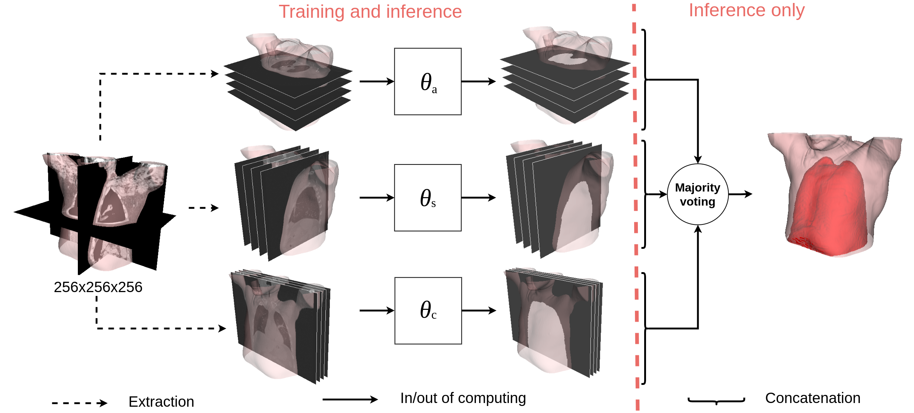

# deep_learning_motion_mask_segmention

Repo to developp interactive tools for deep model trainings

## Run the example

1- make sure you have python3 installed

2- clone this repository on your machine and go in it:

    cd deep_learning_motion_mask_segmention/

3- create a virtual environments

    python3 -m venv motion_mask_seg

4- activate the virtual environment

    source motion_mask_seg/bin/activate

5- update pip3 repository and install dependencies listed in the requirements.txt

    pip3 install --upgrade pip
    python3 -m pip install -r requirements.txt

6- Run the example illustrated above program

    python3 main.py

## Notes

steps
